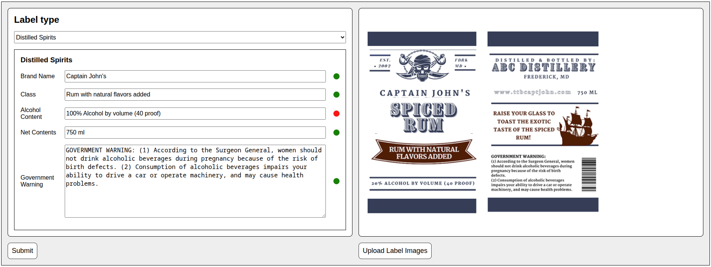

# AI-Powered Alcohol Label Verification App

A minimal AI-powered alcohol label verification application prototype. The app verifies if label anatomy fields match the anatomy of the label(s).

## User Interface



## Features

- Limited dependencies in order to facilitate code audits. The only run-time dependency is the OpenAI client.
- A [prompt](https://github.com/adpatter/ai-powered-alcohol-label-verification-app/tree/main/apps/api/src/prompts/anatomy.ts) that encourages reasoning prior to classification.
- The output format is semi‑structured (reasoning + labeled classifications), rather than rigid JSON, to support better reasoning.

## Assumptions

1. The app must be able to match on the following label anatomy parts:

- Brand Name
- Class/Type
- Alcohol Content
- Net Contents
- Government Warning

2. The app must be easy to use.

3. The app must handle errors gracefully.

4. The app must handle a single set of anatomy parts but should be easily extensible to batch uploads.

5. The app must provide results within 5 seconds.

## Limitations

- Currently locked into OpenAI API; however, it would be easy to implement an interface in order to switch out LLM providers.
- The same prompt is used for all label types. The code is written in order to be easily refactored to handle more complex label tasks.

## Technology

The implementation consists of a conventional full-stack monorepo. The backend is in [`./apps/api`](https://github.com/adpatter/ai-powered-alcohol-label-verification-app/tree/main/apps/api). The frontend is in [`./apps/web`](https://github.com/adpatter/ai-powered-alcohol-label-verification-app/tree/main/apps/web).

### Backend

- Native Node.js web server

### Frontend

- Web components
- Webpack

### Run-time Dependencies

- Node.js `>=24.0.0`
- npm `>=11.0.0`
- OpenAI client

## Project Structure

### API

- `apps/api`: HTTPS static file server.

### Web

- `apps/web`: Front-end assets (bundled by Webpack).
- `apps/web/dist/ai-powered-alcohol-label-verification-app` Web root.

## Deployment instructions

1. Clone the repository:

```bash
git clone https://github.com/adpatter/ai-powered-alcohol-label-verification-app.git
```

2. Change directory into the repository:

```bash
cd ai-powered-alcohol-label-verification-app
```

3. Install dependencies at the repo root:

```bash
npm install
```

4. Build the apps:

```bash
npm run build
```

5. Create your environment file:

```bash
cp .env.example .env
```

6. Update `.env` values (see [Environment Variables](#environment-variables) below).

7. Run the server:

```bash
npm run start
```

### Environment Variables

The API reads these values from `.env`:

- `KEY_PATH`: Path to your TLS private key.
- `CERT_PATH`: Path to your TLS certificate.
- `WEB_ROOT`: Absolute path to the web build output (e.g. `[...]/apps/web/dist`).
- `LOCATION_PATH`: A path prefix for the app (e.g. `/ai-powered-alcohol-label-verification-app`).
- `HOST_NAME`: Bind address (e.g. `0.0.0.0`).
- `PORT`: HTTPS port (e.g. `8443`).
- `OPENAI_API_KEY`: Your OpenAI API key.
- `MAX_BODY_LENGTH`: Maximum allowed POST body length (e.g., 1e8) in bytes.

Your .env should look like this:

```env
KEY_PATH = "/home/null/ssl/farlabs_dev/farlabs_dev.key"
CERT_PATH = "/home/null/ssl/farlabs_dev/farlabs_dev.crt"
WEB_ROOT = "/home/null/workspace/repos/adpatter/ai-powered-alcohol-label-verification-app/apps/web/dist"
LOCATION_PATH = "/ai-powered-alcohol-label-verification-app"
HOST_NAME = "example.com"
PORT = 8443
OPENAI_API_KEY = ""
MAX_BODY_LENGTH = 1e8
```

### Commands

From the repo root:

### Build

- Build all:

```bash
npm run build
```

- Build api:

```bash
npm run build:api
```

- Build web:

```bash
npm run build:web
```

### Lint

- Lint all:

```bash
npm run lint
```

- Lint api:

```bash
npm run lint:api
```

- Lint web:

```bash
npm run lint:web
```

### Format

- Format all:

```bash
npm run format
```

- Format api:

```bash
npm run format:api
```

- Format web:

```bash
npm run format:web
```

### Run the server

- Start server:

```bash
npm run start
```

### Watch for changes

- Watch all:

```bash
npm run monitor
```

- Watch api:

```bash
npm run monitor:api
```

- Watch web:

```bash
npm run monitor:web
```

## Notes

- Web assets are built into `./apps/web/dist/ai-powered-alcohol-label-verification-app` and served by the API.
- `.env` is ignored by git (see .gitignore); use `.env.example` as a template.
- Front and back test labels can be found in [`./artifacts`](https://github.com/adpatter/ai-powered-alcohol-label-verification-app/tree/main/artifacts): [./artifacts/front.png](https://github.com/adpatter/ai-powered-alcohol-label-verification-app/blob/main/artifacts/front.png) and [./artifacts/back.png](https://github.com/adpatter/ai-powered-alcohol-label-verification-app/blob/main/artifacts/back.png).
- The form is pre-filled for matching against the front and back test labels.
